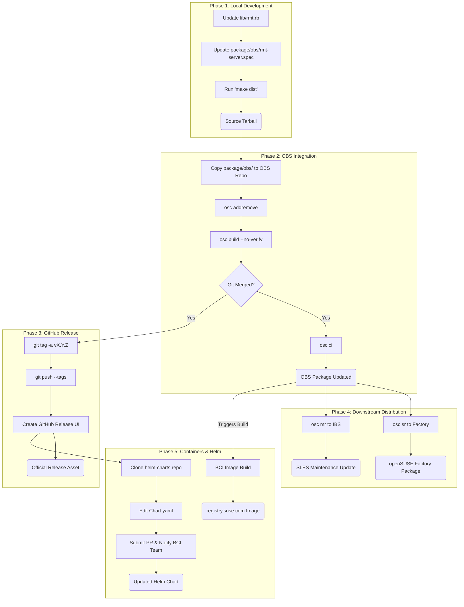

# RMT Release Workflow

This reference documents the release lifecycle of **rmt-server**, visualizing the flow from local code changes to final distribution across openSUSE, SLES, and Container Registries.

## Version-Specific Workflows

**RMT 2.x (master branch):** Traditional OBS-only workflow. No git-based package management.

**RMT 3.x (rmt_3 branch):** Git-first workflow with OBS integration. See [git-workflow.md](git-workflow.md) for git operations.

**Repository Usage:**
- **src.opensuse.org** + **api.opensuse.org**: openSUSE Factory, Tumbleweed, Leap builds
- **src.suse.de** + **api.suse.de**: SLE-based builds (requires VPN)

## Action Plan

### Phase 1: Preparation & Local Version Update

#### RMT 2.x (master branch) - Traditional OBS
1.  **Update Version Strings:**
    *   Modify `lib/rmt.rb` to reflect the new version.
    *   Modify `package/obs/rmt-server.spec` to match.
2.  **Update Changelog:**
    *   **Action:** Change to `package/obs/` directory.
    *   **Action:** Run `osc vc` to edit the `.changes` file with version notes.
    *   **Format:** Include references (e.g., `bsc#123456`, `jsc#XXX-123456`)
    *   **Note:** This must be done before generating the tarball as the `.changes` file is included in the distribution.
3.  **Generate Distribution Tarball:**
    *   **Pre-flight Check:** Ensure `public/repo` exists: `mkdir -p public/repo`.
    *   **Environment:** Must use Ruby 2.5.9 (via Docker for RMT 2.x).
    *   **Action:** Run `make dist`.

#### RMT 3.x (rmt_3 branch) - Git-Based
1.  **Clone/Update Git Repository:**
    *   **For Factory/Tumbleweed/Leap:** `git clone gitea@src.opensuse.org:systemsmanagement/rmt-server`
    *   **For SLE builds (VPN required):** `git clone gitea@src.suse.de:systemsmanagement/rmt-server`
    *   **Note:** Use SSH with `gitea@` for write access
2.  **Update Version Strings:**
    *   Modify `lib/rmt.rb` to reflect the new version.
    *   Modify `package/obs/rmt-server.spec` to match.
3.  **Update Changelog:**
    *   **Action:** Change to `package/obs/` directory.
    *   **Action:** Run `osc vc` to edit the `.changes` file with version notes.
    *   **Format:** Include references (e.g., `bsc#123456`, `jsc#XXX-123456`)
    *   **Note:** This must be done before generating the tarball as the `.changes` file is included in the distribution.
4.  **Generate Distribution Tarball:**
    *   **Pre-flight Check:** Ensure `public/repo` exists: `mkdir -p public/repo`.
    *   **Environment:** Use appropriate Ruby version for RMT 3.x.
    *   **Action:** Run `make dist`.
5.  **Commit to Git:**
    *   **Action:** `git add lib/rmt.rb package/obs/rmt-server.spec package/obs/rmt-server.changes`
    *   **Action:** `git commit -m "Release version X.Y.Z"`
    *   **Push/PR:** Push directly or create PR depending on permissions (see [git-workflow.md](git-workflow.md))

### Phase 2: Open Build Service (OBS) Update

#### RMT 2.x - IBS Only
1.  **Working Copy Setup:**
    *   Checkout from IBS: `osc -A https://api.suse.de co Devel:SCC:RMT rmt-server`
    *   Navigate to workspace: `cd Devel:SCC:RMT/rmt-server`
2.  **Sync & Cleanup:**
    *   **Action:** Manually delete any old versioned tarballs (e.g., `rm rmt-server-*.tar.bz2`).
    *   **Action:** Copy contents from the RMT repository's `package/obs/` to the OBS workspace.
    *   **Action:** Run `osc addremove` to update staged file set.
3.  **Local Verification Build:**
    *   Identify targets: `osc repos`.
    *   Run build: `osc build <target> <arch> --no-verify`.
4.  **Submit to IBS:**
    *   Execute `osc ci` to upload staged file set.

#### RMT 3.x - OBS for Factory, IBS for SLE
1.  **Working Copy Setup:**
    *   **For Factory/Tumbleweed/Leap:** `osc -A https://api.opensuse.org co systemsmanagement:SCC:RMT rmt-server`
    *   **For SLE (VPN required):** `osc -A https://api.suse.de co Devel:SCC:RMT rmt-server`
2.  **Sync & Cleanup:**
    *   **Important:** Wait for git PR to be merged first.
    *   **Action:** Manually delete any old versioned tarballs (e.g., `rm rmt-server-*.tar.bz2`).
    *   **Action:** Copy contents from the git repository's `package/obs/` to the OBS workspace.
    *   **Action:** Review with `osc status` and run `osc addremove`.
3.  **Local Verification Build:**
    *   Identify targets: `osc repos`.
    *   Run build: `osc build <target> <arch> --no-verify`.
4.  **Submit to OBS/IBS:**
    *   **Note:** Only perform after Git PR merge.
    *   Execute `osc ci` to upload staged file set.

### Phase 3: GitHub Release

**Applies to both RMT 2.x and RMT 3.x:**

1.  **Tagging:**
    *   **Pre-check:** Ensure the remote is correct (`git remote -v`) and the tag doesn't already exist (`git ls-remote --tags`).
    *   **Action:** Create a signed/annotated tag: `git tag -a v<version> -m "Release v<version>"`.
    *   **Action:** Push tag to GitHub: `git push origin v<version>`.
2.  **Publish Release:**
    *   Navigate to GitHub and create a formal release from the pushed tag.

### Phase 4: Submissions (Factory & SLES)

#### RMT 2.x - SLES Only (IBS)
1.  **SLES Maintenance Update:**
    *   **Network Requirement:** Must be on the internal SUSE network or VPN (`api.suse.de`).
    *   **Action:** Identify maintained codestreams: `osc -A https://api.suse.de maintained rmt-server`.
    *   **Target Streams:** SLE 15 SP4, SP5, SP6, SP7
    *   **Action:** For each codestream, submit a maintenance request:
        ```bash
        osc -A https://api.suse.de mr Devel:SCC:RMT rmt-server SUSE:SLE-15-SP4:Update
        osc -A https://api.suse.de mr Devel:SCC:RMT rmt-server SUSE:SLE-15-SP5:Update
        osc -A https://api.suse.de mr Devel:SCC:RMT rmt-server SUSE:SLE-15-SP6:Update
        osc -A https://api.suse.de mr Devel:SCC:RMT rmt-server SUSE:SLE-15-SP7:Update
        ```
    *   **Note:** Ensure changelog entries include references (e.g., `bsc#123456`, `jsc#XXX-123456`).

#### RMT 3.x - Factory + SLES
1.  **openSUSE Factory (OBS):**
    *   **Action:** Submit the update: `osc sr systemsmanagement:SCC:RMT rmt-server openSUSE:Factory`.
    *   **Note:** Uses `api.opensuse.org` for Tumbleweed/Leap.
2.  **SLES Maintenance Update (IBS):**
    *   **Network Requirement:** Must be on VPN for `api.suse.de`.
    *   **Action:** Identify maintained codestreams: `osc -A https://api.suse.de maintained rmt-server`.
    *   **Action:** For each codestream, submit a maintenance request: `osc -A https://api.suse.de mr Devel:SCC:RMT rmt-server <TARGET_CODESTREAM>`.
    *   **Note:** Ensure changelog entries include references (e.g., `bsc#123456`, `jsc#XXX-123456`).

### Phase 5: Container & Helm Chart Updates
1.  **Container Image:**
    *   **Automation:** The image is built automatically by BCI pipelines upon RPM publication.
    *   **Action:** Monitor build: [devel:BCI:SLE-15-SP7/rmt-server-image](https://build.opensuse.org/package/show/devel:BCI:SLE-15-SP7/rmt-server-image).
2.  **Helm Chart Update (Manual):**
    *   **Action:** Clone [SUSE/helm-charts](https://github.com/SUSE/helm-charts.git).
    *   **Action:** Update `rmt-helm/Chart.yaml` (`version`, `appVersion`, `BuildTag`).
    *   **Action:** Submit PR and notify the BCI team (#proj-bci Slack).
3.  **Verification:**
    *   Verify availability at `registry.suse.com/suse/rmt-server`.

## Lifecycle Graph


