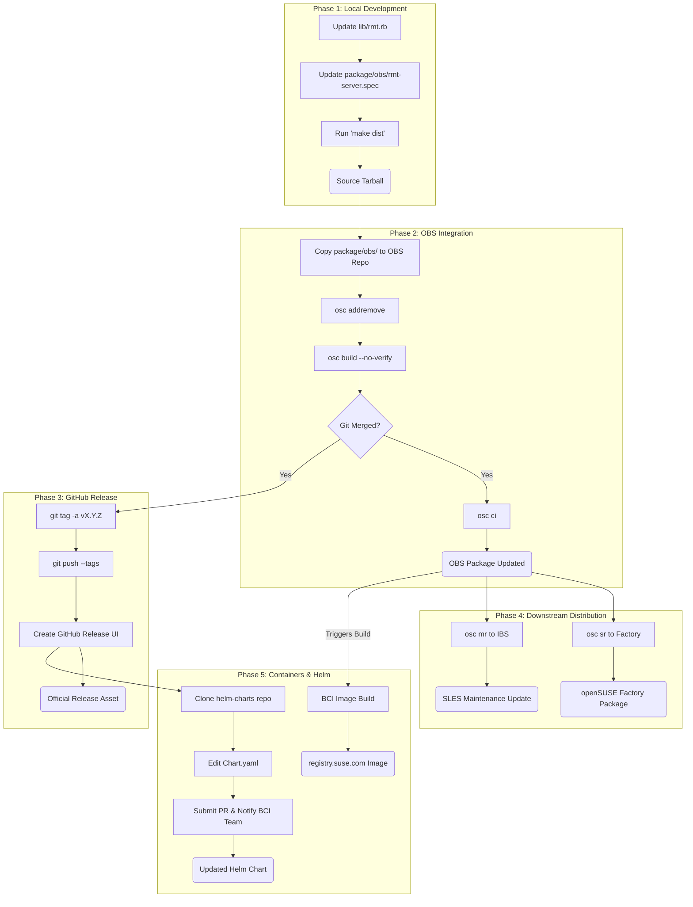

# RMT Release Workflow

This reference documents the release lifecycle of **rmt-server**, visualizing the flow from local code changes to final distribution across openSUSE, SLES, and Container Registries.

## Action Plan

### Phase 1: Preparation & Local Version Update
1.  **Update Version Strings:**
    *   Modify `lib/rmt.rb` to reflect the new version.
    *   Modify `package/obs/rmt-server.spec` to match.
2.  **Generate Distribution Tarball:**
    *   **Pre-flight Check:** Ensure `public/repo` exists: `mkdir -p public/repo`.
    *   **Environment:** Must use Ruby 2.5.9 (via Docker).
    *   **Action:** Run `make dist`.

### Phase 2: Open Build Service (OBS) Update
1.  **Working Copy Setup:**
    *   Find the local workspace (e.g., `~/obs/rmt-server` or specified path).
    *   Verify the API URL: `osc -A https://api.opensuse.org ls`.
2.  **Sync & Cleanup:**
    *   **Action:** Manually delete the old versioned tarball (e.g., `rm rmt-server-2.26.tar.bz2`).
    *   **Action:** Copy contents from the RMT repository's `package/obs/` to the OBS workspace.
    *   **Action:** Review status: `osc status` and `osc diff`.
3.  **Local Verification Build:**
    *   Identify targets: `osc repos`.
    *   Run build: `osc build <target> <arch> --no-verify` (e.g., `osc build 15.6 x86_64 --no-verify`).
4.  **Submit to OBS:**
    *   **Note:** Only perform after Git merge.
    *   Execute `osc ci`.

### Phase 3: GitHub Release
1.  **Tagging:**
    *   **Pre-check:** Ensure the remote is correct (`git remote -v`) and the tag doesn't already exist (`git ls-remote --tags`).
    *   **Action:** Create a signed/annotated tag: `git tag -a v<version> -m "Release v<version>"`.
    *   **Action:** Push tag to GitHub: `git push origin v<version>`.
2.  **Publish Release:**
    *   Navigate to GitHub and create a formal release from the pushed tag.

### Phase 4: Submissions (Factory & SLES)
1.  **openSUSE Factory:**
    *   **Action:** Submit the update: `osc sr systemsmanagement:SCC:RMT rmt-server openSUSE:Factory`.
2.  **SLES Maintenance Update (IBS):**
    *   **Network Requirement:** Must be on the internal SUSE network or VPN (`api.suse.de`).
    *   **Action:** Identify maintained codestreams: `osc -A https://api.suse.de maintained rmt-server`.
    *   **Action:** For each identified codestream, submit a maintenance request: `osc -A https://api.suse.de mr Devel:SCC:RMT rmt-server <TARGET_CODESTREAM>`.
    *   **Note:** Ensure changelog entries include references (e.g., `bsc#123456`, `fate#123456`).

### Phase 5: Container & Helm Chart Updates
1.  **Container Image:**
    *   **Automation:** The image is built automatically by BCI pipelines upon RPM publication.
    *   **Action:** Monitor build: [devel:BCI:SLE-15-SP7/rmt-server-image](https://build.opensuse.org/package/show/devel:BCI:SLE-15-SP7/rmt-server-image).
2.  **Helm Chart Update (Manual):**
    *   **Action:** Clone [SUSE/helm-charts](https://github.com/SUSE/helm-charts.git).
    *   **Action:** Update `rmt-helm/Chart.yaml` (`version`, `appVersion`, `BuildTag`).
    *   **Action:** Submit PR and notify the BCI team (#proj-bci Slack).
3.  **Verification:**
    *   Verify availability at `registry.suse.com/suse/rmt-server`.

## Lifecycle Graph

