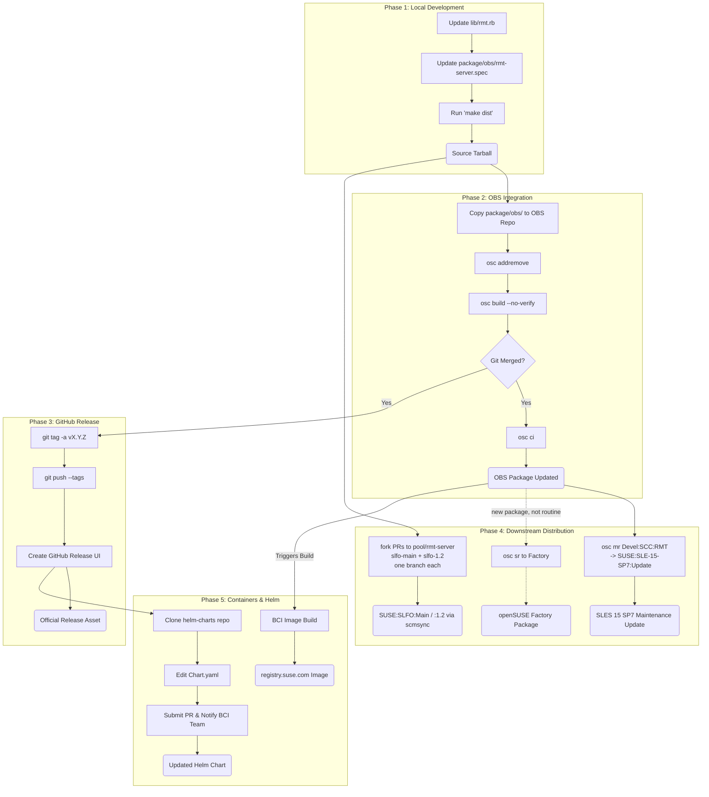

# RMT Release Workflow

This reference documents the release lifecycle of **rmt-server**, visualizing the flow from local code changes to final distribution across openSUSE, SLES, and Container Registries.

## Version-Specific Workflows

**RMT 2.x (master branch):** Traditional OBS-only workflow. No git-based package management.

**RMT 3.x (rmt_3 branch):** Git-first workflow with OBS integration. See [git-workflow.md](git-workflow.md) for git operations.

**Repository Usage:**
- **src.opensuse.org** + **api.opensuse.org**: openSUSE Factory, Tumbleweed, Leap builds
- **src.suse.de** + **api.suse.de**: SLE-based builds (requires VPN)

## Action Plan

### Phase 1: Preparation & Local Version Update

#### RMT 2.x (master branch) - Traditional OBS
1.  **Update Version Strings:**
    *   Modify `lib/rmt.rb` to reflect the new version.
    *   Modify `package/obs/rmt-server.spec` to match.
2.  **Update Changelog:**
    *   **Action:** Change to `package/obs/` directory.
    *   **Action:** Run `osc vc` to edit the `.changes` file with version notes.
    *   **Format:** Include references (e.g., `bsc#123456`, `jsc#XXX-123456`)
    *   **BLOCKING GATE (precondition for every later submission):** the entry for this version **must** contain at least one tracker reference — `bsc#NNNNNNN`, `jsc#XXX-NNN` or `fate#NNNNNN`. An entry without one blocks Factory/SLE/IBS submission. Verify:
        ```bash
        head -20 package/obs/rmt-server.changes | grep -Eq 'bsc#[0-9]{6,7}|jsc#[A-Z]+-[0-9]+|fate#[0-9]+' && echo OK || echo "BLOCKER: no tracker reference"
        ```
    *   **Note:** This must be done before generating the tarball as the `.changes` file is included in the distribution.
3.  **Generate Distribution Tarball:**
    *   **Pre-flight Check:** Ensure `public/repo` exists: `mkdir -p public/repo`.
    *   **Environment:** Must use Ruby 2.5.9 (via Docker for RMT 2.x).
    *   **Action:** Run `make dist`.

#### RMT 3.x (rmt_3 branch) - Git-Based

**Two repositories are involved — don't conflate them:**

*   **Source:** `github.com/SUSE/rmt`, branch `rmt_3` — where `lib/rmt.rb`, `package/obs/rmt-server.spec` and `package/obs/rmt-server.changes` are edited and reviewed. Steps 2–4 below happen here.
*   **Packaging:** `pool/rmt-server` on `src.suse.de` / `src.opensuse.org` — receives the built artifacts (tarball, man page, spec, changes) per product branch. Step 5 and Phase 4 happen here.

1.  **Clone/Update the packaging repository** (needed later, in Phase 4):
    *   **SLFO/SLE (VPN required):** `git clone gitea@src.suse.de:pool/rmt-server` — or your fork, with `pool/rmt-server` added as `upstream`
    *   **Public mirror:** `git clone gitea@src.opensuse.org:pool/rmt-server`
    *   **Note:** Use SSH with `gitea@` for write access, and have `git-lfs` installed
2.  **Update Version Strings** (in the source repo, on `rmt_3`):
    *   Modify `lib/rmt.rb` to reflect the new version.
    *   Modify `package/obs/rmt-server.spec` to match.
3.  **Update Changelog:**
    *   **Action:** Change to `package/obs/` directory.
    *   **Action:** Run `osc vc` to edit the `.changes` file with version notes.
    *   **Format:** Include references (e.g., `bsc#123456`, `jsc#XXX-123456`)
    *   **BLOCKING GATE (precondition for every later submission):** the entry for this version **must** contain at least one tracker reference — `bsc#NNNNNNN`, `jsc#XXX-NNN` or `fate#NNNNNN`. An entry without one blocks the Factory submit request and any agit PR to a product branch. Verify:
        ```bash
        head -20 package/obs/rmt-server.changes | grep -Eq 'bsc#[0-9]{6,7}|jsc#[A-Z]+-[0-9]+|fate#[0-9]+' && echo OK || echo "BLOCKER: no tracker reference"
        ```
    *   **Note:** Update the changelog before generating the tarball, so the packaging artifacts and the git state describe the same release.
4.  **Generate Distribution Tarball:**
    *   **Pre-flight Check:** Ensure `public/repo` exists: `mkdir -p public/repo`.
    *   **Environment:** Built in the Docker container; use `docker compose run --rm -v "$PWD":/srv/www/rmt rmt make build-tarball` when there is no TTY for `make dist`.
    *   **Action:** Run `make dist`.
    *   **Caution:** `build-tarball` runs `clean`, which deletes `package/obs/*.tar.bz2` — back up the existing tarball if it is the only copy.
5.  **Merge the release branch on GitHub:**
    *   The version bump, spec change and changelog entry go through a normal PR against `rmt_3`.
    *   Everything downstream (OBS, `pool/rmt-server`, the tag) is built from the merged commit, so rebuild the tarball if further commits land on `rmt_3` after the first build.

### Phase 2: Open Build Service (OBS) Update

#### RMT 2.x - OBS + IBS (`...:RMT2` projects)
1.  **Working Copy Setup:**
    *   openSUSE builds: `osc -A https://api.opensuse.org co systemsmanagement:SCC:RMT2 rmt-server`
    *   SLE maintenance (VPN): `osc -A https://api.suse.de co Devel:SCC:RMT2 rmt-server`
    *   Navigate to workspace: `cd <project>/rmt-server`
2.  **Sync & Cleanup:**
    *   **Action:** Manually delete any old versioned tarballs (e.g., `rm rmt-server-*.tar.bz2`).
    *   **Action:** Copy contents from the RMT repository's `package/obs/` to the OBS workspace.
    *   **Action:** Run `osc addremove` to update staged file set.
3.  **Local Verification Build:**
    *   Identify targets: `osc repos`.
    *   Run build: `osc build <target> <arch> --no-verify`.
4.  **Submit to IBS:**
    *   Execute `osc ci` to upload staged file set.

#### RMT 3.x - OBS for Factory, IBS for SLE
1.  **Working Copy Setup:**
    *   **For Factory/Tumbleweed/Leap:** `osc -A https://api.opensuse.org co systemsmanagement:SCC:RMT rmt-server`
    *   **For SLE (VPN required):** `osc -A https://api.suse.de co Devel:SCC:RMT rmt-server`
2.  **Sync & Cleanup:**
    *   **Important:** Wait for git PR to be merged first.
    *   **Action:** Manually delete any old versioned tarballs (e.g., `rm rmt-server-*.tar.bz2`).
    *   **Action:** Copy contents from the git repository's `package/obs/` to the OBS workspace.
    *   **Action:** Review with `osc status` and run `osc addremove`.
3.  **Local Verification Build:**
    *   Identify targets: `osc repos`.
    *   Run build: `osc build <target> <arch> --no-verify`.
4.  **Submit to OBS/IBS:**
    *   **Note:** Only perform after Git PR merge.
    *   Execute `osc ci` to upload staged file set.

### Phase 3: Git Tagging and GitHub Release

**Applies to both RMT 2.x and RMT 3.x:**

1.  **Git Tagging (Automated):**
    *   **Pre-check:** Ensure the remote is correct (`git remote -v`) and the tag doesn't already exist (`git ls-remote --tags`).
    *   **Action:** Create an annotated tag: `git tag -a v<version> -m "Release v<version>"`.
    *   **Action:** Push tag to remote: `git push origin v<version>`.
2.  **GitHub Release Creation (Manual UI Step):**
    *   **Action:** Navigate to the GitHub "Releases" page.
    *   **Action:** Click "Draft a new release".
    *   **Action:** Select the pushed tag (e.g., `v<version>`).
    *   **Action:** Add release notes and changelog.
    *   **Action:** Publish the release.
    
    **Note:** Git tagging and GitHub Releases are distinct operations. The tag is a git object; a GitHub Release is a UI feature that combines a tag with release notes and optional artifacts.

### Phase 4: Submissions (Factory & SLES)

> **BLOCKING GATE — run before any submission below.** `package/obs/rmt-server.changes` must have an entry for the release version carrying at least one tracker reference (`bsc#NNNNNNN`, `jsc#XXX-NNN` or `fate#NNNNNN`). SUSE maintenance/QA tooling rejects submissions with no trackable reference. If this check fails, stop and add the reference first.
>
> ```bash
> head -20 package/obs/rmt-server.changes | grep -Eq 'bsc#[0-9]{6,7}|jsc#[A-Z]+-[0-9]+|fate#[0-9]+' && echo OK || echo "BLOCKER: no tracker reference"
> ```

#### RMT 2.x - SLES (IBS, from `Devel:SCC:RMT2`)
1.  **SLES Maintenance Update:**
    *   **Pre-check (blocking):** Run the tracker-reference check above — `osc mr` must not be run until it prints `OK`.
    *   **Network Requirement:** Must be on the internal SUSE network or VPN (`api.suse.de`).
    *   **Action:** Identify maintained codestreams: `osc -A https://api.suse.de maintained rmt-server`.
    *   **Target Streams:** SLE 15 SP4, SP5, SP6, SP7
    *   **Action:** For each codestream, submit a maintenance request from the v2 project `Devel:SCC:RMT2`:
        ```bash
        osc -A https://api.suse.de mr Devel:SCC:RMT2 rmt-server SUSE:SLE-15-SP4:Update
        osc -A https://api.suse.de mr Devel:SCC:RMT2 rmt-server SUSE:SLE-15-SP5:Update
        osc -A https://api.suse.de mr Devel:SCC:RMT2 rmt-server SUSE:SLE-15-SP6:Update
        osc -A https://api.suse.de mr Devel:SCC:RMT2 rmt-server SUSE:SLE-15-SP7:Update
        ```
    *   **Note:** Ensure changelog entries include references (e.g., `bsc#123456`, `jsc#XXX-123456`).

#### RMT 3.x - SLFO + SLE 15 SP7 (+ Factory)

**1. SLFO / SLES 16 (fork PR against `pool/rmt-server`):**

*   **Pre-check (blocking):** Run the tracker-reference check above — no PR may be opened until it prints `OK`.
*   **Network Requirement:** Must be on VPN for `src.suse.de`.
*   **Access:** Non-maintainers cannot agit-push to `pool/rmt-server` (`not authorized to write to pool/rmt-server`). Work from a fork; `origin` = `<you>/rmt-server`, `upstream` = `pool/rmt-server`.
*   **Prepare:** Branch off `upstream/slfo-main`, replace the packaging files from `package/obs/` (delete the previous tarball first), commit. `git-lfs` must be installed.
*   **Submit:** `slfo-main` (→ 16.1) and `slfo-1.2` (→ 16.0) each need a PR, and **each PR needs its own source branch** — see below.
    ```bash
    git branch release-<version>-slfo-1.2 release-<version>-slfo-main
    git push origin release-<version>-slfo-main release-<version>-slfo-1.2

    for t in slfo-main slfo-1.2; do
      git-obs pr create --source <you>/rmt-server:release-<version>-$t \
                        --target pool/rmt-server:$t \
                        --title "Update to rmt-server <version>" \
                        --description "Version <version> (bsc#NNNNNNN)"
    done
    ```
*   **Do not share one source branch between the two PRs.** `autogits_workflow_pr_bot` auto-closes the older PR when a second one reuses its branch. This happened during the 3.1.0 release (PR #7 closed when #8 reused `release-3.1.0`).
*   **Verify after creating:** the bot fires a minute or two later and `git-obs pr create` reports success regardless. `git-obs pr get pool/rmt-server#<N>` must show `State: open`; a healthy PR then attracts `autogits_obs_staging_bot` (build-results link) and `autobuild-review` (group review, approved by an `@autobuild-review: approve` comment).
*   Staging builds and forwarding to `SUSE:SLFO:Main` / `SUSE:SLFO:1.2` are handled by the bots.

**2. SLE 15 SP7 Maintenance Update (IBS):**

*   **Pre-check (blocking):** Run the tracker-reference check above — `osc mr` must not be run until it prints `OK`.
*   **Pre-check:** The OBS devel project must hold the final version and have built successfully; `Devel:SCC:RMT` follows it automatically through its `_link`.
    ```bash
    osc -A https://api.suse.de cat Devel:SCC:RMT rmt-server rmt-server.changes | head -8
    osc -A https://api.suse.de mr Devel:SCC:RMT rmt-server SUSE:SLE-15-SP7:Update
    ```
*   **Note:** When asked whether to supersede an existing request, answer **no** — superseding cancels the release process for that codestream.

**2a. Correcting an SP7 submission after the fact:**

> **RULE — always submit against `SUSE:SLE-15-SP7:Update`. Never submit against a `SUSE:Maintenance:<N>` incident.** Once the `mr` is accepted an incident is created and the maintenance team files their own `maintenance_release` request from it. Corrections go to the codestream exactly the way the original submission did, and **the maintenance team takes care of merging them into the open incident.** (Maintenance team guidance, 2026-08-13.)

*   Submit the correction the same way as the original request — no incident-specific flags:
    ```bash
    osc -A https://api.suse.de mr Devel:SCC:RMT rmt-server SUSE:SLE-15-SP7:Update -m "..."
    ```
*   **Do not pass `--incident <N>`.** Targeting the incident directly is what the maintenance team has asked us not to do; it is their queue to manage.
*   **Do not try to supersede their release request.** `osc mr ... --supersede <release-request>` fails with `HTTP Error 403: You have no role in request <N>` — a release request belongs to maintenance, not to us. Note that `osc mr` **still creates the new request** before the supersede call fails, so check for a stray duplicate and revoke it with `osc -A https://api.suse.de request revoke <id> -m "..."`.
*   Comment on the incident so maintenance know a correction is on its way.

**3. openSUSE Factory Submission (OBS):**

*   **Reality check:** `openSUSE:Factory` currently has **no** `rmt-server` package and the `factory`/`leap-16.x` branches are stale at 2.18 — this is a new-package submission, not a routine release step. Confirm with `osc -A https://api.opensuse.org ls openSUSE:Factory rmt-server` before starting.
*   **Pre-check (blocking):** Run the tracker-reference check above — `osc sr` must not be run until it prints `OK`.

*   **Pre-check:** Check for existing submit requests:
    ```bash
    osc -A https://api.opensuse.org request list systemsmanagement:SCC:RMT rmt-server openSUSE:Factory
    ```

*   **Submit:** Create submit request:
    ```bash
    osc -A https://api.opensuse.org sr systemsmanagement:SCC:RMT rmt-server openSUSE:Factory \
      -m "Submit rmt-server <version> to Factory
    
    Key changes and bug fixes with bsc# references"
    ```

*   **Monitor:** Check request status:
    ```bash
    osc -A https://api.opensuse.org request show <request-id>
    ```

*   **If Rejected:** 
    1. Check rejection reason in request details
    2. Fix issue in git repo and commit
    3. Copy fixed files to OBS workspace: `cp package/obs/* <OBS-workspace>/systemsmanagement:SCC:RMT/rmt-server/`
    4. Commit to OBS: `osc -A https://api.opensuse.org ci -m "Fix: <issue>"`
    5. Resubmit with `--supersede <old-request-id>`

See [git-workflow.md](git-workflow.md) for the branch mapping, the fork PR mechanics, and the PR bots.

### Phase 5: Container & Helm Chart Updates
1.  **Container Image:**
    *   **Automation:** The image is built automatically by BCI pipelines upon RPM publication.
    *   **Action:** Monitor build: [devel:BCI:SLE-15-SP7/rmt-server-image](https://build.opensuse.org/package/show/devel:BCI:SLE-15-SP7/rmt-server-image).
2.  **Helm Chart Update (Manual):**
    *   **Action:** Clone [SUSE/helm-charts](https://github.com/SUSE/helm-charts.git).
    *   **Action:** Update `rmt-helm/Chart.yaml` (`version`, `appVersion`, `BuildTag`).
    *   **Action:** Submit PR and notify the BCI team (#proj-bci Slack).
3.  **Verification:**
    *   Verify availability at `registry.suse.com/suse/rmt-server`.

## Lifecycle Graph


```mermaid
graph TD
    subgraph Phase1 [Phase 1: Local Development]
        A1[Update lib/rmt.rb] --> A2[Update package/obs/rmt-server.spec]
        A2 --> A3[Run 'make dist']
        A3 --> Art1(Source Tarball)
    end

    subgraph Phase2 [Phase 2: OBS Integration]
        Art1 --> B1[Copy package/obs/ to OBS Repo]
        B1 --> B2[osc addremove]
        B2 --> B3[osc build --no-verify]
        B3 --> B4{Git Merged?}
        B4 -- Yes --> B5[osc ci]
        B5 --> Art2(OBS Package Updated)
    end

    subgraph Phase3 [Phase 3: GitHub Release]
        B4 -- Yes --> C1[git tag -a vX.Y.Z]
        C1 --> C2[git push --tags]
        C2 --> C3[Create GitHub Release UI]
        C3 --> Art3(Official Release Asset)
    end

    subgraph Phase4 [Phase 4: Downstream Distribution]
        Art1 --> D0[fork PRs to pool/rmt-server<br/>slfo-main + slfo-1.2<br/>one branch each]
        D0 --> Art8(SUSE:SLFO:Main / :1.2 via scmsync)

        Art2 --> D2[osc mr Devel:SCC:RMT<br/>-> SUSE:SLE-15-SP7:Update]
        D2 --> Art5(SLES 15 SP7 Maintenance Update)

        Art2 -.new package, not routine.-> D1[osc sr to Factory]
        D1 -.-> Art4(openSUSE Factory Package)
    end

    subgraph Phase5 [Phase 5: Containers & Helm]
        Art2 -- Triggers Build --> E1[BCI Image Build]
        E1 --> Art6(registry.suse.com Image)
        
        C3 --> F1[Clone helm-charts repo]
        F1 --> F2[Edit Chart.yaml]
        F2 --> F3[Submit PR & Notify BCI Team]
        F3 --> Art7(Updated Helm Chart)
    end
```
